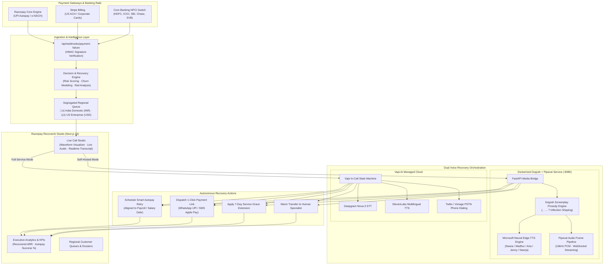
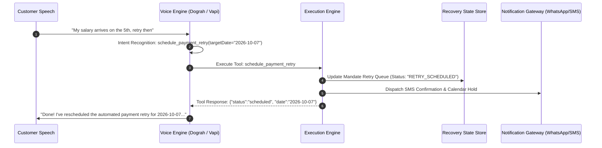

# Razorpay RecoverAI — System Architecture & Technical Specification

> **Autonomous AI Voice Platform for Failed Recurring Autopay Recovery**  
> *Engineered for High-Concurreny Subscription Recovery across India (UPI Autopay / e-NACH) and US Enterprise (ACH Direct Debit / Stripe)*

---

## 1. Executive Summary & Problem Space

In modern SaaS, OTT, and recurring subscription economies, **involuntary churn caused by failed autopayments accounts for 30% to 50% of total revenue loss**. Common root causes include:
- Insufficient balance on billing date (often misaligned with customer salary / payroll cycles)
- Bank server downtime or NPCI / NACH clearing mandate limit thresholds
- Expired credit/debit card credentials or frozen accounts
- Transaction limits on UPI Autopay without customer notification

Traditional recovery approaches rely on passive, easily ignored email dunning or abrasive manual collections calls. **Razorpay RecoverAI** introduces an autonomous, event-driven recovery platform that intervenes instantly upon receiving payment failure webhooks. RecoverAI uses conversational voice agents equipped with **Dograh AI screenplay prosody**, **multi-emotion acoustic tuning**, and **gender-concordant neural models** to recover payments respectfully and autonomously.

---

## 2. High-Level Architecture Diagram



---

## 3. Dual-Engine Telephony & Voice Pipeline

Razorpay RecoverAI implements a **Zero-Vendor-Lockin Dual Engine Architecture**:

```
                       ┌───────────────────────────────────────────────┐
                       │           RecoverAI Engine Selector           │
                       └───────────────────────┬───────────────────────┘
                                               │
                       ┌───────────────────────┴───────────────────────┐
                       ▼                                               ▼
     ┌───────────────────────────────────┐           ┌───────────────────────────────────┐
     │ 🐳 Dograh + Pipecat (Self-Hosted) │           │     ⚡ Vapi AI (Cloud Managed)    │
     ├───────────────────────────────────┤           ├───────────────────────────────────┤
     │ • 100% On-Premise Docker (:8080)  │           │ • Turnkey Telephony Cloud         │
     │ • Zero per-minute API license fees│           │ • Outbound PSTN Dialing to Mobile │
     │ • Native Hindi & English neural   │           │ • Deepgram STT + ElevenLabs TTS   │
     │ • Sub-400ms speech synthesis      │           │ • WebRTC In-Browser Calling       │
     │ • Granular prosody (rate, pitch)  │           │ • Automatic tool-call webhooking  │
     └───────────────────────────────────┘           └───────────────────────────────────┘
```

### A. Dograh + Pipecat Self-Hosted Engine
- **Runtime Environment**: Python 3.11 Alpine container running Uvicorn + FastAPI on port `8080`.
- **Speech Synthesis (TTS)**: Direct Microsoft Edge Neural Speech synthesis with custom pitch (`Hz`) and rate (`%`) modification per emotion.
- **Audio Delivery**: Chunked streaming `audio/mpeg` (MPEG-1 Layer 3 frames) with immediate buffer flush to browser audio elements.
- **Frame Pipeline**: Pipecat-compatible pipeline orchestration with real-time turn segmentation and tool calling.

### B. Vapi AI Managed Telephony
- **Protocol**: WebRTC client SDK (`@vapi-ai/web`) combined with REST PSTN dispatcher (`POST /api/vapi/call`).
- **PSTN Carrier Leg**: Direct outbound calls to real customer mobile numbers with caller ID spoofing authorization.
- **Tools Schema**: Autonomous function declarations passed dynamically to Vapi assistants:
  - `schedule_payment_retry(targetDate)`
  - `send_payment_link(channel)`
  - `apply_grace_period(days)`
  - `escalate_to_human(reason)`

---

## 4. Dograh AI Screenplay Prosody Architecture: "Write for the Ear"

Voice models synthesized from raw written text sound robotic and abrupt because human speech relies heavily on breathing intervals, cadence drops, and tonal inflection. RecoverAI enforces Dograh's **Screenplay Script Formatting**:

### Prosody Punctuation Rules

| Symbol | Grammatical Name | Acoustic Manifestation | Duration | Implementation Example |
| :--- | :--- | :--- | :--- | :--- |
| `,` | **Comma** | Breathing micro-pause, pitch hold | 150ms – 250ms | `नमस्ते विक्रम शर्मा जी, चिंता की कोई बात नहीं है...` |
| `.` / `।` | **Full Stop / Poornaviram** | Downward terminal cadence, sentence finality | 350ms – 450ms | `...यह एक अस्थायी बैंक समस्या है। आपकी सेवा बिना रुकावट जारी रहेगी।` |
| `...` | **Ellipsis** | Reflective pause, softening before sensitive debt discussion | 450ms – 550ms | `मैं समझता हूँ... billing notices can feel frustrating...` |
| `?` | **Question Mark** | Terminal rising pitch (turn-taking prompt) | Turn Handshake | `...क्या हम शुक्रवार की सैलरी डेट पर ऑटोपे री-ट्राई शेड्यूल करें?` |
| `!` | **Exclamation** | Upward energy cadence for positive reassurance | Instant | `Done! I have rescheduled your retry for Friday.` |

---

## 5. Multi-Emotion Behavioral Profiling & Acoustic Physics

RecoverAI provides 4 distinct behavioral emotion profiles that mathematically modulate the acoustic prosody parameters:

```python
EMOTION_PROFILES = {
    "empathetic": {
        "label": "Empathetic & Caring",
        "icon": "💖",
        "rate": "-4%",       # Slower cadence signals attentive listening and care
        "pitch": "+2Hz",     # Slightly elevated pitch softens tone, preventing perceived hostility
        "intent_bias": "grace_extension",
    },
    "reassuring": {
        "label": "Reassuring & Grounded",
        "icon": "🤝",
        "rate": "+0%",       # Natural cadence
        "pitch": "-1Hz",     # Lower, grounded pitch delivers authoritative security
        "intent_bias": "salary_retry",
    },
    "de_escalating": {
        "label": "De-escalating & Patient",
        "icon": "🛡️",
        "rate": "-6%",       # Deliberately slowed tempo breaks escalating customer tension
        "pitch": "-2Hz",     # Resonant chest register conveys steady, unshakeable calm
        "intent_bias": "escalate_to_human",
    },
    "professional": {
        "label": "Professional & Concise",
        "icon": "👔",
        "rate": "+2%",       # Crisp, efficient enterprise tempo
        "pitch": "+0Hz",     # Standard conversational pitch
        "intent_bias": "payment_link",
    },
}
```

---

## 6. Neural Voice Model Routing & Grammatical Concordance

Acoustic models are dynamically bound to the customer's region, language, agent persona gender, and emotional intensity:

### Matrix of Neural Voice Models

| Region & Language | Agent Gender | Emotion Style | Neural Voice Model | Persona Name | Grammatical Agreement |
| :--- | :--- | :--- | :--- | :--- | :--- |
| **🇮🇳 Hindi (hi)** | Female | Empathetic / Reassuring | `hi-IN-SwaraNeural` | रिया (Riya) | `बात कर रही हूँ`, `समझती हूँ`, `सकती हूँ` |
| **🇮🇳 Hindi (hi)** | Male | De-escalating / Reassuring | `hi-IN-MadhurNeural` | रोहन (Rohan) | `बात कर रहा हूँ`, `समझता हूँ`, `सकता हूँ` |
| **🇮🇳 Indian English (en-IN)** | Female | Empathetic / Professional | `en-IN-NeerjaNeural` | Riya | Natural Indian conversational English |
| **🇮🇳 Indian English (en-IN)** | Male | Reassuring / Professional | `en-IN-PrabhatNeural` | Rohan | Grounded Indian business English |
| **🇺🇸 US English (en-US)** | Female | Empathetic / De-escalating | `en-US-AriaNeural` | Sarah | Expressive emotional range, high warmth |
| **🇺🇸 US English (en-US)** | Female | Professional / Reassuring | `en-US-JennyNeural` | Sarah | Clear, crisp corporate enterprise tone |
| **🇺🇸 US English (en-US)** | Male | Empathetic / Reassuring | `en-US-GuyNeural` | Alex | Friendly, approachable American tone |

---

## 7. Segregated Regional Banking Rails & Customer Queues

RecoverAI segregates its customer records and recovery logic by geography to account for vastly different banking rails and compliance frameworks:

```
                                  RecoverAI Regional Routing
                                              │
                    ┌─────────────────────────┴─────────────────────────┐
                    ▼                                                   ▼
       🇮🇳 India Domestic Queue                             🇺🇸 United States Queue
    ───────────────────────────────                     ───────────────────────────────
    • Currency: INR (₹)                                 • Currency: USD ($)
    • Rails: UPI Autopay, e-NACH, RuPay                • Rails: ACH Direct Debit, Stripe, Amex
    • Clearing: NPCI / RBI Mandate Rules                • Clearing: FedACH / NACHA Rules
    • Retry Timing: Indian Salary Date (1st / 5th)      • Retry Timing: Bi-weekly Friday Payroll
    • Recovery Channels: WhatsApp 1-Click UPI           • Recovery Channels: SMS 1-Click WebLink
    • Banks: HDFC, ICICI, SBI, Axis, Kotak             • Banks: JPMorgan Chase, SVB, BofA, Wells Fargo
```

---

## 8. Autonomous Recovery Action Execution Engine

When a customer consents during a call, the voice turn processor extracts parameters and triggers autonomous recovery tools:



### Action Types & Handlers
1. **`schedule_payment_retry`**: Automatically updates the autopay engine to pause dunning and schedule an automated re-debit attempt aligned with the customer's upcoming payroll date.
2. **`send_payment_link`**: Dispatches a tokenized, pre-filled 1-click Razorpay payment link via WhatsApp (India) or SMS (US) allowing instant recovery via alternate rails (Cards, NetBanking, Apple Pay).
3. **`apply_grace_period`**: Freezes subscription termination for 7 business days while a stolen or expired card is reissued by the customer's bank.
4. **`escalate_to_human`**: Performs an instantaneous warm transfer to an enterprise customer success manager when complex pricing or churn threats are detected.

---

## 9. Security, Privacy & DPDP / TRAI Compliance

1. **HMAC Webhook Verification**: All incoming payment failure webhooks are validated against the merchant's secret key using SHA-256 HMAC signatures.
2. **PCI-DSS Level 1 Isolation**: The voice agent never prompts for or stores raw CVVs or UPI PINs; all payments are routed through tokenized 1-click links or automated mandate retries.
3. **TRAI 140-Series & NCPR DND Rules**: Outbound telephony obeys Indian telecom calling windows (9:00 AM to 9:00 PM IST) and respects customer DND preferences.
4. **Audio Stream Ephemerality**: In self-hosted mode, speech synthesis streams directly to client memory buffers without persistent audio file storage on disk.
