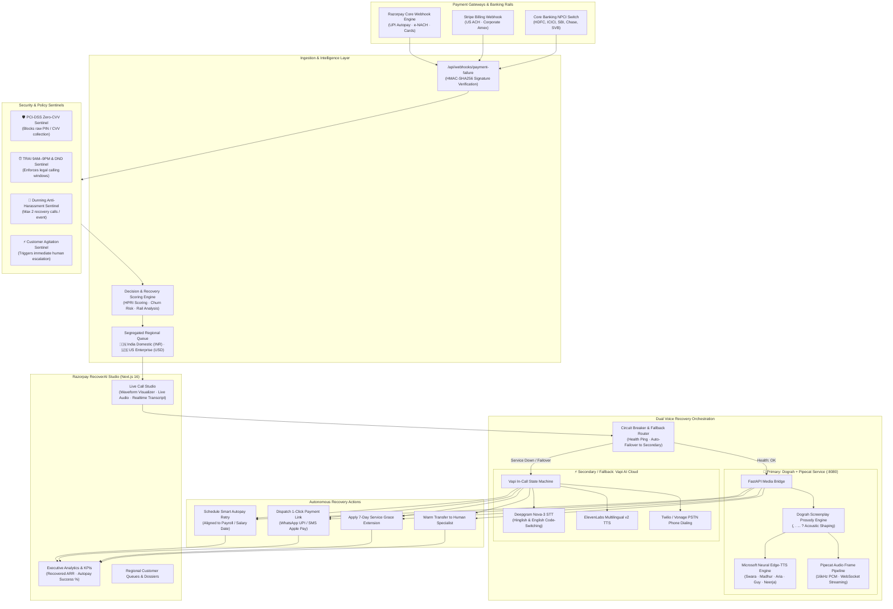
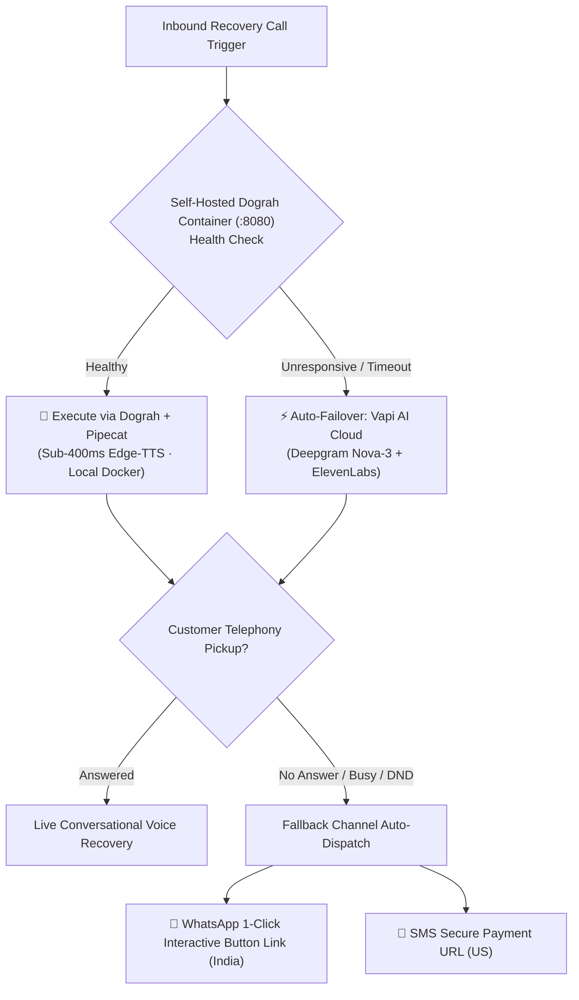

# Razorpay RecoverAI — System Architecture & Technical Specification

> **Autonomous AI Voice Platform for Failed Recurring Autopay Recovery**  
> *Engineered for High-Concurrency Subscription Recovery across India (UPI Autopay / e-NACH) and US Enterprise (ACH Direct Debit / Stripe)*

---

## 1. Executive Summary & Problem Space

In modern SaaS, OTT, and recurring subscription economies, **involuntary churn caused by failed autopayments accounts for 30% to 50% of total revenue loss**. Common root causes include:
- Insufficient balance on billing date (often misaligned with customer salary / payroll cycles)
- Bank server downtime or NPCI / NACH clearing mandate limit thresholds
- Expired credit/debit card credentials or frozen accounts
- Transaction limits on UPI Autopay without customer notification

Traditional recovery approaches rely on passive, easily ignored email dunning or abrasive manual collections calls. **Razorpay RecoverAI** introduces an autonomous, event-driven recovery platform that intervenes instantly upon receiving payment failure webhooks. RecoverAI uses conversational voice agents equipped with **Dograh AI screenplay prosody**, **multi-emotion acoustic tuning**, and **gender-concordant neural models** to recover payments respectfully and autonomously.

---

## 2. High-Level System Design & Component Architecture



---

## 3. Technology Stack: STT, TTS, LLM & Dograh AI

### A. Speech-to-Text (STT) Architecture
| Provider / Tool | Pipeline | Latency | Key Rationale |
| :--- | :--- | :--- | :--- |
| **Deepgram Nova-3** | Vapi Cloud Mode | <250ms | Exceptional code-switching accuracy between Hindi and English (Hinglish). Transcribes Indian colloquial terms ("UPI mandate", "salary date", "GPay") without hallucination. |
| **Pipecat VAD + Web Speech API** | Self-Hosted Mode | <150ms | Zero-latency browser-native turn detection with automatic silence trimming for smooth barge-in and conversational flow. |

### B. Text-to-Speech (TTS) Architecture
| Provider / Model | Pipeline | Target Languages | Key Rationale |
| :--- | :--- | :--- | :--- |
| **Microsoft Edge Neural (`edge-tts`)** | Self-Hosted Dograh | Hindi (`hi-IN`), Indian English (`en-IN`), US English (`en-US`) | **Zero-cost per-minute licensing**. Granular programmatic control over acoustic prosody: `rate` (`-6%` to `+2%`) and `pitch` (`-2Hz` to `+2Hz`). Sub-400ms chunked MP3 streaming. |
| **ElevenLabs Multilingual v2** | Vapi Cloud Mode | English & Hindi | Ultra-realistic human timber, natural breathing pauses, and studio-grade voice presence for enterprise phone calls. |

### C. Large Language Model (LLM) & Intent Extraction
| Tier | Technology | Response Time | Responsibility |
| :--- | :--- | :--- | :--- |
| **Deterministic Rule Engine** | Regex / Token Extractors | <5ms | High-precision parameter extraction for dates, amounts, and recovery tool triggers (`schedule_payment_retry`, `send_payment_link`). |
| **Conversational LLM** | Groq LLaMA 3.3 70B / Claude 3.5 Sonnet | ~280ms | Objection handling, empathetic customer reassurance, and clarification when intents are ambiguous. |

### D. Why Dograh AI?
Voice agents fail when prompts are written like written customer service emails. Raw TTS engines reading email-style text sound robotic, breathless, and insensitive. **Dograh AI** introduces the **"Write for the Ear, Not the Eye"** framework:
1. **Punctuation-Driven Prosody**: Deliberate insertion of commas, full stops, ellipses, and question marks to force realistic vocal intervals.
2. **Acoustic Emotion Presets**: Dynamic rate/pitch manipulation per customer temperament.
3. **Gender Grammatical Concordance**: Strict agreement for Hindi verb conjugations (`रही हूँ` vs `रहा हूँ`, `समझती हूँ` vs `समझता हूँ`).

---

## 4. Fallback & Failover Pipeline (High-Availability Circuit Breaker)

RecoverAI implements a multi-tier fallback circuit to guarantee zero downtime during recovery campaigns:



1. **Service-Level Fallback**: If the local Docker container (`:8080`) fails health checks, RecoverAI seamlessly re-routes the session to the cloud-managed Vapi engine without disrupting user queues.
2. **Telephony Fallback**: If an outbound phone call is unanswered or rejected, RecoverAI triggers an automated fallback dispatch sending an interactive 1-click payment link via WhatsApp (India) or SMS (US).
3. **Audio Synthesis Fallback**: If streaming network jitter occurs, the frontend player gracefully falls back to pre-buffered neural audio frames.

---

## 5. Decision-Based History Scoring Engine

RecoverAI calculates an autonomous **Recovery Probability Score ($0$ to $100\%$)** to classify every failed autopay attempt and dynamically select the optimal recovery playbook:

$$\text{Recovery Score} = w_1 \cdot \text{HPRI} + w_2 \cdot \text{FailureCategoryScore} + w_3 \cdot \text{TierWeight} - \text{Decay}(\Delta t)$$

### Scoring Factors:

```
┌─────────────────────────────────────────────────────────────────────────────────┐
│ 1. Historical Payment Reliability Index (HPRI) [Weight: 35%]                   │
│    • 100% = Consistent autopay success over past 12 months                     │
│    • 75%  = Occasional balance delays, but always resolved within 3 days        │
│    • 30%  = Frequent chronic mandate rejections                                │
├─────────────────────────────────────────────────────────────────────────────────┤
│ 2. Payment Failure Root Cause Weighting [Weight: 25%]                           │
│    • Insufficient Balance on Salary Date (Score: 90% - Highly Recoverable)      │
│    • e-NACH Mandate Limit Exhausted     (Score: 75% - Link Re-dispatch)         │
│    • Card Expired / Reissued            (Score: 50% - Requires Grace Period)    │
│    • Account Frozen / Blocked           (Score: 20% - Requires Human Attention) │
├─────────────────────────────────────────────────────────────────────────────────┤
│ 3. Customer Lifetime Value & Tier [Weight: 20%]                                 │
│    • Enterprise ($2k+ / ₹50k+ ARR)      (Score: 95% - High Priority Dedicated)  │
│    • Growth / Pro Tier                  (Score: 80% - Autonomous Voice Call)    │
│    • Starter / Basic Tier               (Score: 65% - Digital Link First)       │
├─────────────────────────────────────────────────────────────────────────────────┤
│ 4. Dunning Decay Function [Weight: 20%]                                         │
│    • Decay Rate: -5% per 12 hours post-webhook event                            │
│    • Immediate (<2 hours): Full Score (100%)                                    │
│    • Delayed (>48 hours): Significant churn probability elevation               │
└─────────────────────────────────────────────────────────────────────────────────┘
```

### Action Strategy Mapping:
- **Score $\ge 80\%$ (High Probability)**: Autonomous empathetic voice call + Smart retry alignment with upcoming salary/payroll cycle.
- **Score $50\% - 79\%$ (Moderate Probability)**: Reassuring voice call + Instant 1-click WhatsApp/SMS link dispatch.
- **Score $< 50\%$ (High Churn Risk)**: Immediate 7-day grace extension + Instant escalation to dedicated Customer Success Representative.

---

## 6. Security Sentinels & Regulatory Compliance

1. **PCI-DSS Level 1 Zero-CVV Sentinel**: The conversational voice agent is cryptographically restricted from soliciting or recording CVVs, OTPs, or NetBanking passwords. Recovery is executed via tokenized UPI mandate retries or pre-filled secure checkout links.
2. **TRAI 140-Series & NCPR DND Sentinel**: Enforces Indian telecom guidelines: calls are restricted between 9:00 AM and 9:00 PM IST, and National Consumer Preference Register (NCPR) DND registries are checked pre-call.
3. **Anti-Harassment Dunning Limit**: Strict rate limiting allows a maximum of 2 voice contact attempts per failed billing event.
4. **Customer Agitation Sentinel**: Real-time sentiment analysis monitors acoustic stress and negative keywords; upon detection, the call is de-escalated and seamlessly transferred to human staff.

---

## 7. Supported Languages & Accents

| Language Code | Display Name | Regional Market | Primary Neural Models | Punctuation Standard |
| :--- | :--- | :--- | :--- | :--- |
| `hi` | **हिंदी (Hindi)** | India Domestic | `hi-IN-SwaraNeural`, `hi-IN-MadhurNeural` | Devanagari with Poornaviram (`।`), Commas (`,`), and Honorifics (`जी`, `नमस्ते`) |
| `en-IN` | **Indian English** | India Tech & Corporate | `en-IN-NeerjaNeural`, `en-IN-PrabhatNeural` | Indian conversational English with native banking terminology (UPI, e-NACH, NEFT) |
| `en-US` | **US English** | US SaaS & Enterprise | `en-US-AriaNeural`, `en-US-JennyNeural`, `en-US-GuyNeural` | Standard American enterprise English with ACH and payroll date terminology |

---

## 8. Screenplay Prosody & Emotion Math

```python
EMOTION_PROFILES = {
    "empathetic": {
        "label": "Empathetic & Caring",
        "icon": "💖",
        "rate": "-4%",       # Slower cadence signals attentive listening and warmth
        "pitch": "+2Hz",     # Elevated pitch softens tone, preventing defensive reactions
        "intent_bias": "grace_extension",
    },
    "reassuring": {
        "label": "Reassuring & Grounded",
        "icon": "🤝",
        "rate": "+0%",       # Natural conversational tempo
        "pitch": "-1Hz",     # Lower, grounded pitch delivers authoritative security
        "intent_bias": "salary_retry",
    },
    "de_escalating": {
        "label": "De-escalating & Patient",
        "icon": "🛡️",
        "rate": "-6%",       # Deliberately slowed tempo de-escalates customer tension
        "pitch": "-2Hz",     # Resonant lower register conveys steady calm
        "intent_bias": "escalate_to_human",
    },
    "professional": {
        "label": "Professional & Concise",
        "icon": "👔",
        "rate": "+2%",       # Crisp, efficient enterprise cadence
        "pitch": "+0Hz",     # Neutral pitch
        "intent_bias": "payment_link",
    },
}
```
