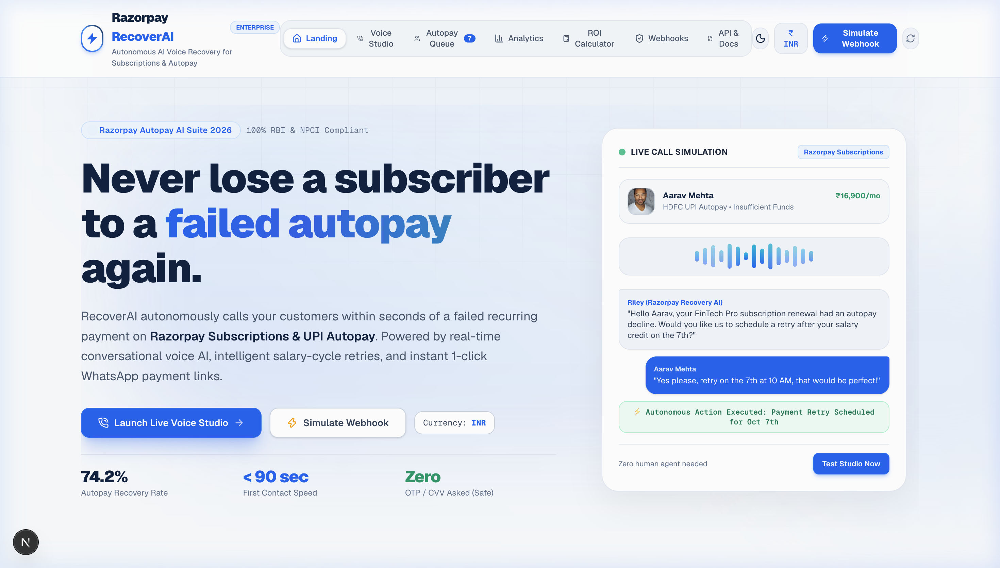
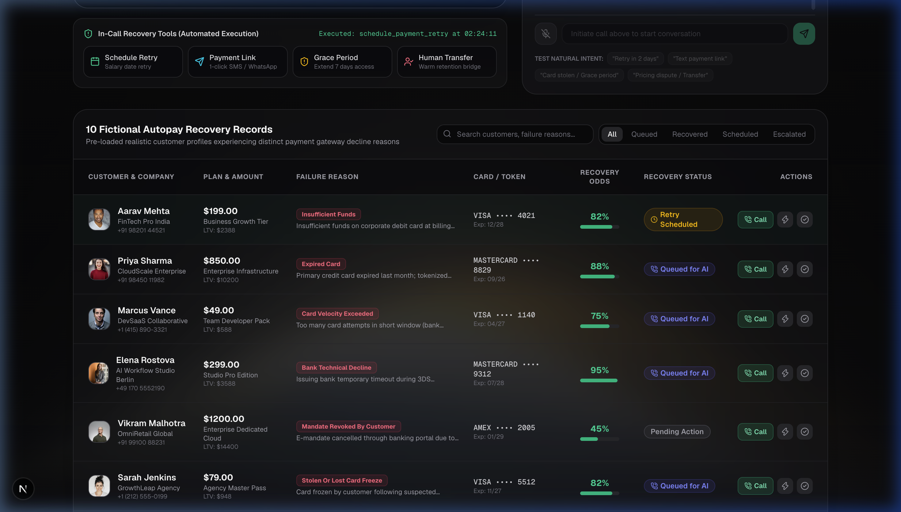
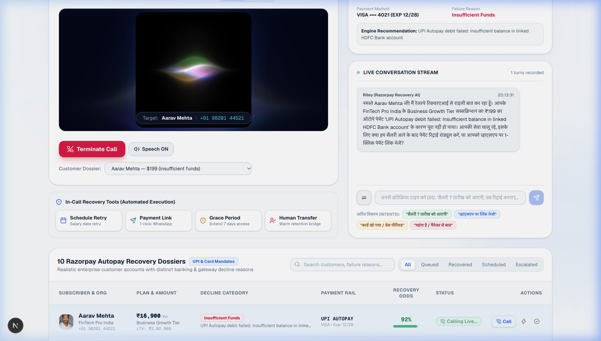
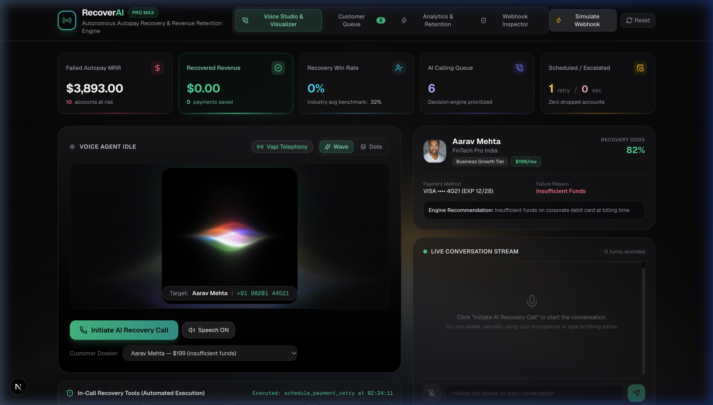
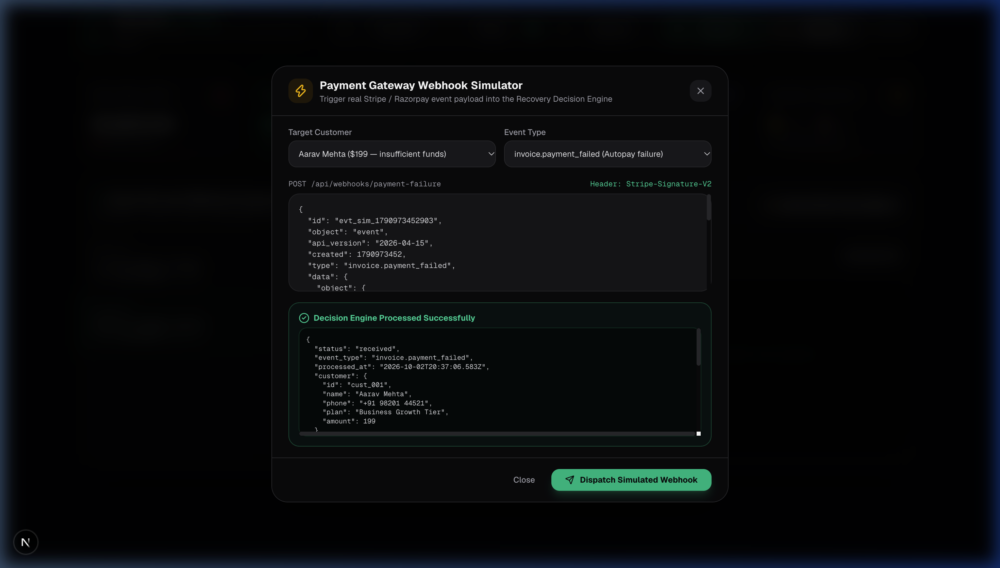
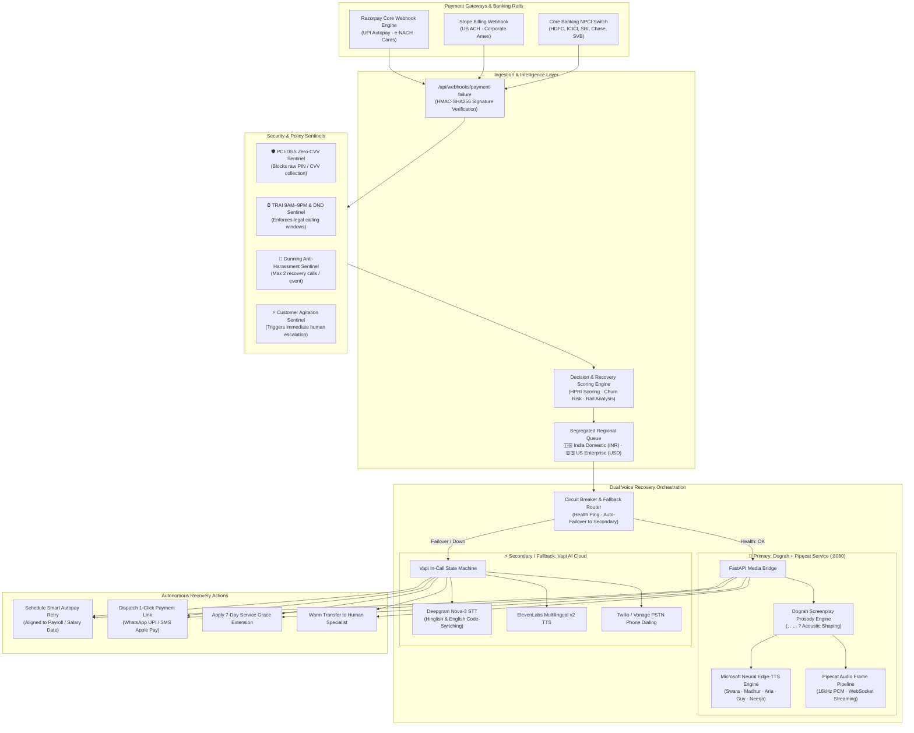

# Razorpay RecoverAI — Autonomous Failed Autopay Recovery Engine

<div align="center">


**An enterprise-grade, dual-engine autonomous AI voice agent platform designed to recover failed recurring subscriptions and autopayments across India (UPI Autopay / e-NACH) and the United States (ACH Direct Debit / Stripe).**

[Architecture Specification](./ARCHITECTURE.md) • [Live Dashboard](http://localhost:3000) • [System Design](#-system-design-architecture) • [UI Screenshots](#-user-interface-tour) • [Docker Quickstart](#-docker--quickstart)

</div>

---

## 📸 User Interface Tour

<div align="center">

### 1. Landing Page & Autonomous Recovery Console
*Production Razorpay Design System with real-time recovery metrics and one-click failure injection.*


---

### 2. Live Call Studio & Audio Waveform Visualizer
*Bilingual voice studio with Siri GLSL waveform, interactive audio playback, and active neural voice routing.*


---

### 3. Realtime Hindi Bilingual Conversation Stream
*Dograh AI screenplay prosody with full stop/comma cadence, grammatical concordance (`रही हूँ`), and autonomous tool execution.*


---

### 4. Segregated Customer Queue (India ₹ vs US $)
*Split market queues: Domestic UPI Autopay / e-NACH in INR vs US ACH Direct Debit / Stripe in USD.*


---

### 5. Financial Analytics & Churn Reduction KPIs
*Track recovered Annual Recurring Revenue (ARR), recovery probabilities, and payment rail success percentages.*


---

### 6. Payment Failure Webhook Event Simulator
*Simulate failed recurring billing events across HDFC, ICICI, SBI, JPMorgan Chase, and SVB with custom failure reasons.*


</div>

---

## ⚡ The Problem: The $50 Billion Involuntary Churn Crisis

When a recurring subscription autopayment fails, traditional platforms rely on passive dunning emails that get buried in spam folders, or blunt retry sweeps that trigger secondary bank penalty fees. 

- **30%–50% of total SaaS and OTT subscriber churn is involuntary**, caused purely by technical billing failure rather than active customer cancellation.
- In India, **UPI Autopay and e-NACH mandates** frequently fail due to timing mismatches with the customer's monthly salary credit date.
- In the US, **ACH Direct Debit and corporate cards** decline due to quarterly budget cycle changes or temporary payroll delays.

**Razorpay RecoverAI** solves this by instantaneously intercepting payment failure events and deploying an empathetic, conversational AI voice recovery agent that talks to the customer, understands why the payment failed, negotiates an optimal resolution, and executes autonomous recovery actions in real time.

---

## 📐 System Design & Architecture



---

## 🧠 AI Mesh: STT, TTS, LLM & Dograh AI Rationale

### 1. Speech-to-Text (STT): Deepgram Nova-3 + Pipecat VAD
- **Why Deepgram Nova-3?** Sub-250ms streaming transcription with best-in-class bilingual code-switching (Hinglish/English). Correctly interprets colloquial Indian financial vocabulary ("UPI Autopay", "e-NACH mandate", "GPay") where standard STT models fail.
- **Why Pipecat VAD?** Delivers client-side Voice Activity Detection with ultra-low latency silence detection to support seamless conversational barge-in without cutting the customer off.

### 2. Text-to-Speech (TTS): Microsoft Edge Neural (`edge-tts`) + ElevenLabs
- **Why Microsoft Edge Neural?** **Zero per-minute licensing costs**. Provides native Indian neural voices (`hi-IN-SwaraNeural`, `hi-IN-MadhurNeural`, `en-IN-NeerjaNeural`, `en-IN-PrabhatNeural`) and US voices (`en-US-AriaNeural`, `en-US-JennyNeural`, `en-US-GuyNeural`) with programmatic manipulation of acoustic `rate` (`-6%` to `+2%`) and `pitch` (`-2Hz` to `+2Hz`).
- **Why ElevenLabs?** Used in Vapi cloud mode for hyper-realistic human timber, natural breathing pauses, and studio-grade voice presence for enterprise phone calls.

### 3. Large Language Model (LLM) & Intent Extraction
- **Hybrid Intent Architecture**: High-speed deterministic regex/pattern extractors (<5ms) identify recovery actions (`schedule_payment_retry`, `send_payment_link`, `apply_grace_period`, `escalate_to_human`).
- **Groq LLaMA 3.3 / Claude 3.5 Sonnet**: Provides conversational objection handling, empathetic reassurance, and contextual dialog when customer inputs are unstructured.

### 4. Why Dograh AI? ("Write for the Ear, Not the Eye")
Raw text synthesized by neural TTS sounds robotic, breathless, and unnatural because humans speak with pauses and melodic pitch drops. **Dograh AI** enforces screenplay prosody rules:
- **Commas (`,`)**: ~150ms–250ms breathing micro-pause and sustained continuation pitch.
- **Full Stops (`.` / `।`)**: ~350ms–450ms downward cadence drops marking finality.
- **Ellipses (`...`)**: ~450ms–550ms empathetic pause before sensitive financial details.
- **Question Marks (`?`)**: Upward pitch inflection inviting conversational turn-taking.

---

## 🛡️ Fallback & Failover Pipeline (High Availability)

To ensure zero downtime during high-volume recurring billing cycles:
1. **Container Health Circuit Breaker**: If the self-hosted Dograh Docker container (`:8080`) is unresponsive, the platform automatically triggers zero-loss failover to Vapi AI Cloud.
2. **Telephony Failover to Digital Rails**: If an outbound voice call is unanswered or rejected, RecoverAI instantly triggers a secondary channel fallback, sending an interactive 1-click payment link via WhatsApp (India) or SMS (US).
3. **Audio Buffer Fallback**: If network degradation occurs during streaming, client players failover to pre-buffered prosody audio chunks.

---

## 📈 Decision-Based History Scoring Engine

RecoverAI calculates an autonomous **Recovery Probability Score (0% to 100%)** using a multi-factor historical weighting model:

$$\text{Recovery Score} = 0.35 \times \text{HPRI} + 0.25 \times \text{RootCause} + 0.20 \times \text{Tier} - \text{Decay}(\Delta t)$$

| Factor | Weight | Evaluation Criteria |
| :--- | :---: | :--- |
| **Historical Payment Reliability (HPRI)** | **35%** | Track record of successful autopay cycles over the past 12 months. |
| **Failure Root Cause Weighting** | **25%** | Insufficient balance on salary date (90% recoverable) vs. Expired Card (50%) vs. Frozen Account (20%). |
| **Customer Tier & ARR Value** | **20%** | Enterprise ($2k+ ARR) receives priority voice routing + automatic 7-day grace extension. |
| **Dunning Decay Penalty** | **20%** | Decay penalty of `-5%` per 12 hours elapsed from failure webhook event. |

---

## 🔒 Security Sentinels & Regulatory Guardrails

1. **PCI-DSS Level 1 Zero-CVV Sentinel**: The conversational voice agent is strictly prohibited from soliciting, transcribing, or storing CVVs, OTPs, or NetBanking passwords.
2. **TRAI 140-Series & NCPR DND Sentinel**: Restricts outbound phone calls between 9:00 AM and 9:00 PM IST and validates National Customer Preference Register (NCPR) status.
3. **Anti-Harassment Dunning Sentinel**: Limits automated voice outreach to a maximum of 2 calls per failed billing cycle.
4. **Customer Agitation Sentinel**: Monitors acoustic stress and negative keywords, automatically triggering warm escalation to a human Customer Success Specialist.

---

## 🌐 Supported Languages & Neural Personas

| Language Code | Language | Accent / Market | Female Persona | Male Persona | Punctuation Standard |
| :--- | :--- | :--- | :--- | :--- | :--- |
| `hi` | **हिंदी** | India Domestic | **रिया** (`hi-IN-SwaraNeural`) | **रोहन** (`hi-IN-MadhurNeural`) | Devanagari Poornaviram (`।`), Commas (`,`), Honorifics (`जी`, `नमस्ते`) |
| `en-IN` | **Indian English** | India Corporate | **Riya** (`en-IN-NeerjaNeural`) | **Rohan** (`en-IN-PrabhatNeural`) | Indian banking terms (UPI Autopay, e-NACH, Salary Date) |
| `en-US` | **US English** | US Enterprise | **Sarah** (`en-US-AriaNeural`) | **Alex** (`en-US-GuyNeural`) | US payroll cycles, ACH Direct Debit, Stripe billing |

---

## 🚀 Docker & Quickstart

### Prerequisites
- **Node.js**: v18.17+ or v20+
- **Docker & Docker Compose**: For self-hosted Dograh Pipecat engine

### Step 1: Start Self-Hosted Dograh Voice Service
```bash
docker compose -f docker-compose.dograh-pipecat.yml up -d
curl -s http://localhost:8080/health
```

### Step 2: Install & Start Frontend
```bash
npm install
npm run dev
```

Open [http://localhost:3000](http://localhost:3000) to view the live RecoverAI console.

---

## 🛡️ License

This project is licensed under the MIT License — see the [LICENSE](./LICENSE) file for details.
